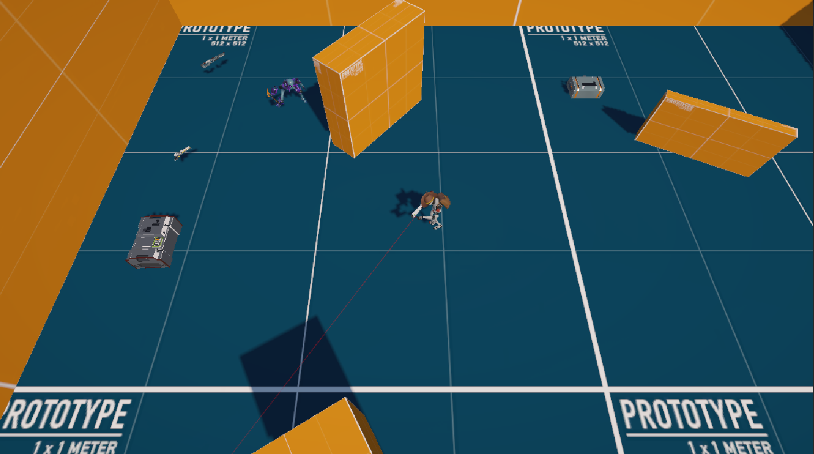
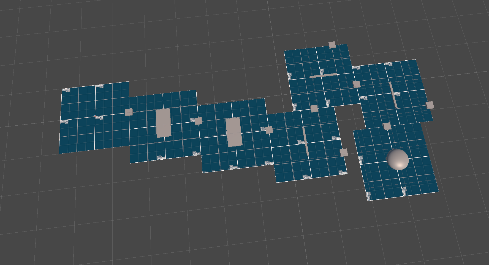

# Top-Down-3D-Shooter-Sandbox

3D Top Down Shooter Project Prototype with fundamental systems implemented.

- The prototype features flexible Object Pooling System for performance improvement.
- Finite State Machine implemented to handle Animations and Player / Enemy States.
- Automatic Level Generation System.
- Weapon System (via Scriptable objects). Easily scalable.
- Melee Enemy with Damage / Death / Trigger Zone Behavior.
- Different Weapon types with recoil system and customizable shooting behavior.
- Weapon Drop / Pickup System.

## Screenshots

## Game Controls
- WASD for Movement.
- SHIFT for Running.
- Left Click for Shooting, Hold Down to shoot with Auto rifles.
- T - on Auto-Rifle switches to Burst Mode (3 shoots at a time).
- E - Interaction (Pick up Weapon / Ammo).
- R - Reload Weapon.
- G - Drop Weapon.
- 1 & 2 - Toggle between Weapons.
- ESC - Quit the Game.

## How to install?
### For Windows User
- Clone the Repository.
- Open Folder Named "Windows_Build.zip".
- Extract the Files.
- Run FPS_Shooter_3D exe file.

## Tools used while developing this project
- Unity.
- Visual Studio Code.
- Coding in C# Programming Language.
- GitBash.

## Contacts 
- E-mail address orkhan.elchuev@gmail.com
- https://github.com/OrkhanElchuev/Top-Down-3D-Shooter-Prototype

## Acknowledgements
- Free Unity Asset Store.
- Mixamo for Animation.
